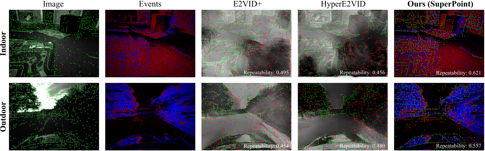
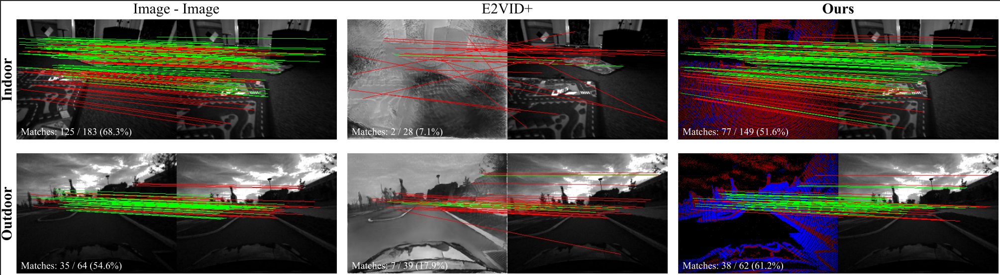

[](https://arxiv.org/abs/2410.21743)


### <p align="center">EI-Nexus: Towards Unmediated and Flexible Inter-Modality Local Feature Extraction and Matching for Event-Image Data
<br>
<div align="center">
  <b>
  <a href="https://www.researchgate.net/profile/Zhonghua-Yi" target="_blank">Zhonghua&nbsp;Yi</a> &middot;
  <a href="https://www.researchgate.net/profile/Shi-Hao-10" target="_blank">Hao&nbsp;Shi</a> &middot;
  <a href="https://www.researchgate.net/profile/Qi-Jiang-63" target="_blank">Qi&nbsp;Jiang</a> &middot;
  <a href="https://www.researchgate.net/profile/Kailun-Yang" target="_blank">Kailun&nbsp;Yang</a> &middot;
  <a href="https://www.researchgate.net/profile/Ze-Wang-42" target="_blank">Ze&nbsp;Wang</a> &middot;
  Diyang&nbsp;Gu &middot;
  Yufan&nbsp;Zhang &middot;
  <a href="https://www.researchgate.net/profile/Kaiwei-Wang-4" target="_blank">Kaiwei&nbsp;Wang</a> 
  </b>
  <br> <br>

  <a href="https://arxiv.org/abs/2410.21743" target="_blank">Arxiv</a>
  <br>
  

####
</div>
<br>
<p align="center">:hammer_and_wrench: :construction_worker: :rocket:</p>
<br>






## News and ToDo
- [x] Release benchmark data.
- [x] Release code and checkpoints.

## Requirements 

The inference code was tested on

* Ubuntu 22.04
* Python 3.10
* [PyTorch](https://pytorch.org/) 2.2.0
* 1 NVIDIA GPU (RTX A800) with CUDA version 12.1.
### Setup an environment
```shell
conda create --name ei_nexus --file requirements.txt
conda activate ei_nexus
```
<mark>Note:</mark> Please follow the version of the dependencies in `requirements.txt` to avoid potential conflicts. 

## Data preparation
To prepare the MVSEC and EC data, download them from the following links:

[MVSEC_RPE](https://huggingface.co/datasets/Zhonghua/MVSEC_RPE/tree/main)

[EC_RPE](https://huggingface.co/datasets/Zhonghua/EC_RPE/tree/main)

After downloading the datasets, create `data` folder and move extracted datasets in it.
The struture of the `data` folder should be as following:
```
data
├── EC
│   ├── boxes_6dof
│   ├── boxes_rotation
│   ├── boxes_rotation_val.txt
│   ├── boxes_translation
│   ├── boxes_translation_val.txt
│   ├── calibration
│   ├── hdr_boxes
│   ├── new_boxes_rotation_val.txt
│   ├── new_boxes_translation_val.txt
│   ├── new_shapes_6dof_val.txt
│   ├── new_shapes_rotation_val.txt
│   ├── new_shapes_translation_val.txt
│   ├── poster_6dof
│   ├── poster_rotation
│   ├── poster_translation
│   ├── shapes_6dof
│   ├── shapes_6dof_val.txt
│   ├── shapes_rotation
│   ├── shapes_rotation_val.txt
│   ├── shapes_translation
│   └── shapes_translation_val.txt
└── MVSEC
    ├── indoor_flying
    ├── indoor_flying_calib
    ├── outdoor_day
    └── outdoor_day_calib
```

## Reproduce Results
Checkpoints of MVSEC and EC data are in [release](https://github.com/ZhonghuaYi/EI-Nexus_official/releases) page.

To reproduce keypoint extraction results, run the `test_events-image_same_time.py`:
```shell
python test_events-image_same_time.py
```
To reproduce matching results, run the `test_events-image_different_time.py`:
```shell
python test_events-image_different_time.py
```

## Train
The training contains two stages, event extractor training stage and matcher training stage.
To train event extractor, refer and modify the `configs/train_EIM_stage1.yaml` config file and simply run the `train_extractor.py` file:
```shell
CUDA_VISIBLE_DEVICES=0 python train_extractor.py
```
To train the matcher, set the matcher as LightGlue in `configs/train_EIM_stage2.yaml` and run the `train_matcher.py` file:
```shell
CUDA_VISIBLE_DEVICES=0 python train_matcher.py
```
The repository uses [Wandb](https://wandb.ai) to manage expriments, comment related code if you don't want to use it.


## Citation
If you find our work useful in your research, please consider citing:

```bibtex
@article{yi2024ei,
  title={EI-Nexus: Towards Unmediated and Flexible Inter-Modality Local Feature Extraction and Matching for Event-Image Data},
  author={Yi, Zhonghua and Shi, Hao and Jiang, Qi and Yang, Kailun and Wang, Ze and Gu, Diyang and Zhang, Yufan and Wang, Kaiwei},
  journal={arXiv preprint arXiv:2410.21743},
  year={2024}
}
```

## Acknowledgement
EI-Nexus is built on top of [LightGlue](https://github.com/cvg/LightGlue), [SiLK](https://github.com/facebookresearch/silk) and [DeepEvTracker](https://github.com/uzh-rpg/deep_ev_tracker) codebases. We appreciate the authors for their greate work and follow the License of EI-Nexus.